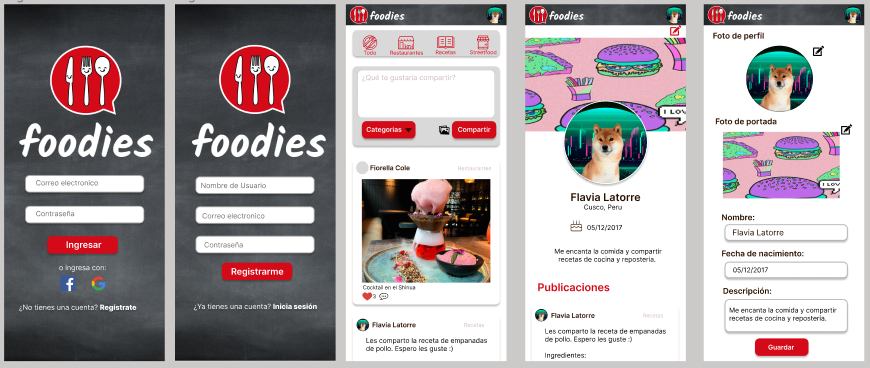
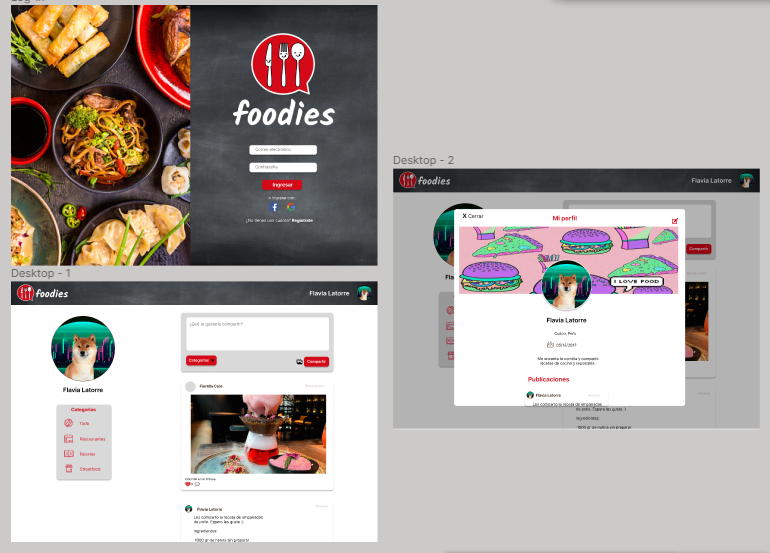

# Creando una Red Social

## Índice

* [1. Preámbulo](#1-preámbulo)
* [2. Resumen del proyecto](#2-resumen-del-proyecto)
* [3. Planificación](#3-planificación-📋)
* [4. Prototipos](#4-prototipos-🚀)
* [5. Interfaz](#5-interfaz)
* [6. Construido con](#6-construido-con-🛠️)
* [7. Objetivos de aprendizaje](#7-objetivos-de-aprendizaje)
* [8. Autoras](#8-autoras-✒️)
 

## 1. Preámbulo

Instagram, Snapchat, Twitter, Facebook, Twitch, Linkedin, etc. Las redes
sociales han invadido nuestras vidas. Las amamos u odiamos, y muchos no podemos
vivir sin ellas.

Hay redes sociales de todo tipo y para todo tipo de intereses. Por ejemplo,
en una ronda de financiamiento con inversionistas, se presentó una red social
para químicos en la que los usuarios podían publicar artículos sobre sus
investigaciones, comentar en los artículos de sus colegas, y filtrar artículos
de acuerdo a determinadas etiquetas o su popularidad, lo más reciente, o lo
más comentado.

## 2. Resumen del proyecto

Foodies, es una red social dirigida a los amantes de la comida, para que puedan compartir recetas, recomendaciones y todo lo que deseen sobre comida.
Foodies te permite registrarte, iniciar sesión y poder compartir publicaciones de acuerdo a la categoria que elijan.

## 3. Planificación 📋

### Historias de Usuario

**Historia 1**
Como: nuevo usuaria de Foodies
Quiero: poder registrarme en la red social
Para: poder compartir contenido sobre comida.

**Historia 2**
Como: Usuaria de Foodies
Quiero: loggearme en la pantalla de inicio
Para: poder acceder al contenido de la red social

**Historia 3**
Como: Usuaria de Foodies
Quiero: poder visualizar todas las publicaciones en un muro
Para: ver las publicaciones de otros usuarios

**Historia 4**
Como: Usuaria de Foodies
Quiero: compartir información (contenido)
Para: poder interactuar con otros usuarios

**Historia 5**
Como: Usuaria de Foodies
Quiero: poder editar mis post
Para: poder corregir algún error o agregar algo

**Historia 6**
Como: Usuaria de Foodies
Quiero: eliminar mis posts
Para: que no se muestren los post que no deseo.

**Historia 8**
Como: Usuaria de Foodies
Quiero: Quiero darle like a otras publicaciones
Para: Interactuar con otros usuarios.

## 4. Prototipos 🚀

## 5. Interfaz

https://fiorellitamaya.github.io/LIM018-data-lovers/src

## 6. Construido con 🛠️
* Figma
* Visual Studio Code
* Firebase
* Github

## 7. Objetivos de aprendizaje

Objetivos estudiados:

### HTML
- [X] Uso de HTML semántico

### CSS

- [X] Uso de selectores de CSS
- [X] Modelo de caja (box model): borde, margen, padding
- [X] Uso de flexbox en CSS
- [X] Uso de CSS Grid Layout

### Web APIs

- [X] Uso de selectores del DOM**
- [X] Manejo de eventos del DOM (listeners, propagación, delegación)
- [X] Manipulación dinámica del DOM
- [X] Ruteado (History API, evento hashchange, window.location)

### JavaScript

- [X] Arrays (arreglos)
- [X] Objetos (key, value)
- [X] Diferenciar entre tipos de datos primitivos y no primitivos
- [X] Variables (declaración, asignación, ámbito)
- [X] Uso de condicionales (if-else, switch, operador ternario, lógica booleana)
- [X] Uso de bucles/ciclos (while, for, for..of)
- [X] Funciones (params, args, return)
- [ ] Pruebas unitarias (unit tests)
- [ ] Pruebas asíncronas
- [ ] Uso de mocks y espías
- [X] Módulos de ECMAScript (ES Modules)
- [X] Uso de linter (ESLINT)
- [X] Uso de identificadores descriptivos (Nomenclatura y Semántica)
- [ ] Diferenciar entre expresiones (expressions) y sentencias (statements)
- [ ] Callbacks
- [ ] Promesas

### Control de Versiones (Git y GitHub)

- [X] Git: Instalación y configuración
- [X] Git: Control de versiones con git (init, clone, add, commit, status, push, pull, remote)
- [X] Git: Integración de cambios entre ramas (branch, checkout, fetch, merge, reset, rebase, tag)
- [ ] GitHub: Creación de cuenta y repos, configuración de llaves SSH
- [X] GitHub: Despliegue con GitHub Pages
- [X] GitHub: Colaboración en Github (branches | forks | pull requests | code review | tags)
- [X] GitHub: Organización en Github (projects | issues | labels | milestones | releases)

### user-centricity
- [X] Diseñar un producto o servicio poniendo a la usuaria en el centro

### product-design

- [X] Crear prototipos de alta fidelidad que incluyan interacciones
- [X] Seguir los principios básicos de diseño visual

### research
- [X] Planear y ejecutar testeos de usabilidad de prototipos en distintos niveles de fidelidad

### Firebase

- [X] Firebase Auth
- [X] Firestore

## 8. Autoras ✒️
* [Fiorella Amaya](https://github.com/fiorellitamaya/)
* [Fiorella Cole](https://github.com/FiorellaCole/)